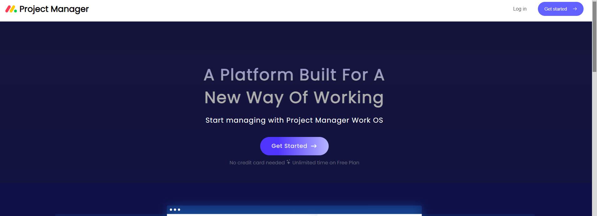
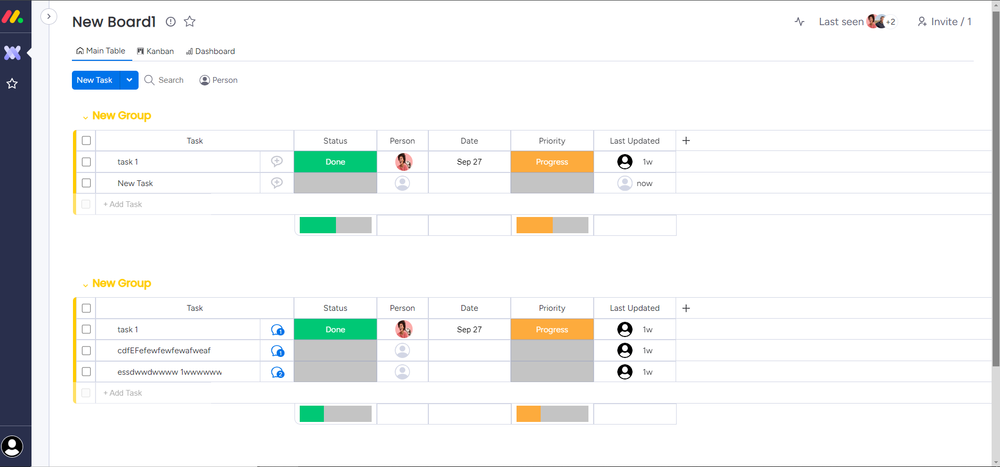
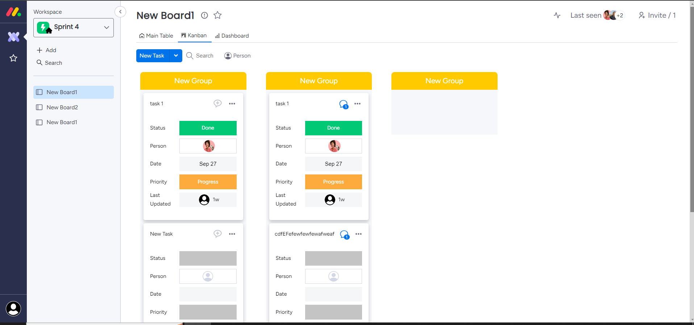
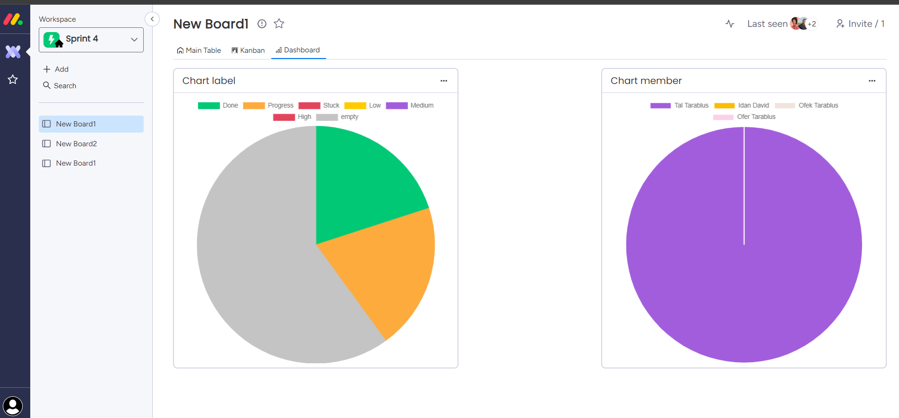

# Gestor de Proyectos

## Descripción

Este es un gestor de proyectos desarrollado con el stack MERN (MongoDB, Express, React y Node.js). La aplicación utiliza WebSockets para actualizar el tablero en tiempo real, permitiendo una colaboración fluida entre los usuarios. Las llamadas a la API del backend se realizan mediante el método REST.

## Características

- Gestión de proyectos y tareas
- Actualizaciones en tiempo real mediante WebSockets
- Interfaz de usuario intuitiva
- API REST para la comunicación con el backend

## Tecnologías Utilizadas

- **Frontend:** React
- **Backend:** Node.js, Express
- **Base de Datos:** MongoDB
- **Comunicación:** WebSockets

## Capturas de Pantalla

### Página de Inicio



### Tablero de Proyectos



### Vista kanban



### Graficos de projectos



## Instalación

### Clonar el repositorio
```bash
git clone https://github.com/edwarenrique2704/ecommerce.git


Configurar el frontend
Navega a la carpeta del frontend:

cd frontend

Instala las dependencias:

npm install

Inicia la aplicación:
npm run dev

Uso
Abre tu navegador y ve a http://localhost:3030 para acceder a la aplicación.
Regístrate o inicia sesión para comenzar a explorar los productos.

Licencia
Este proyecto está licenciado bajo la Licencia MIT.

Contacto
Si tienes alguna pregunta, no dudes en contactarme:

Edward garcia
edwarenrique2704

